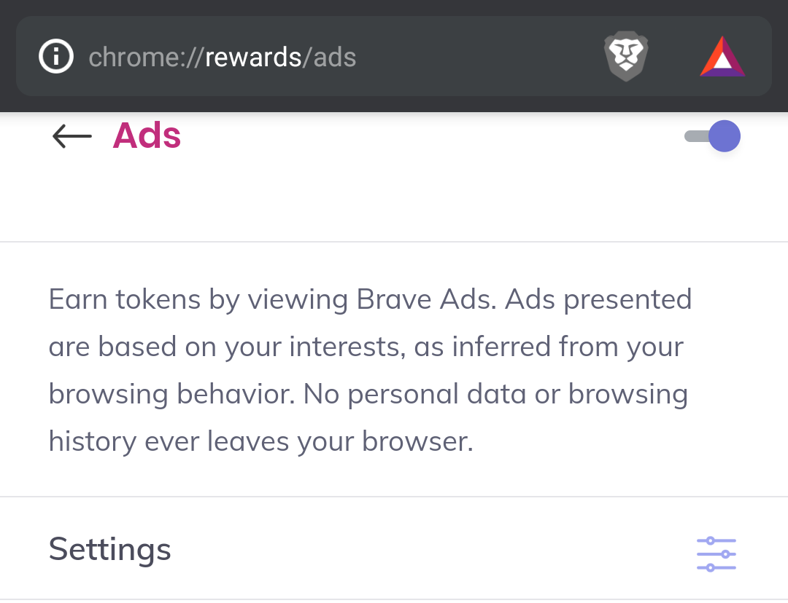
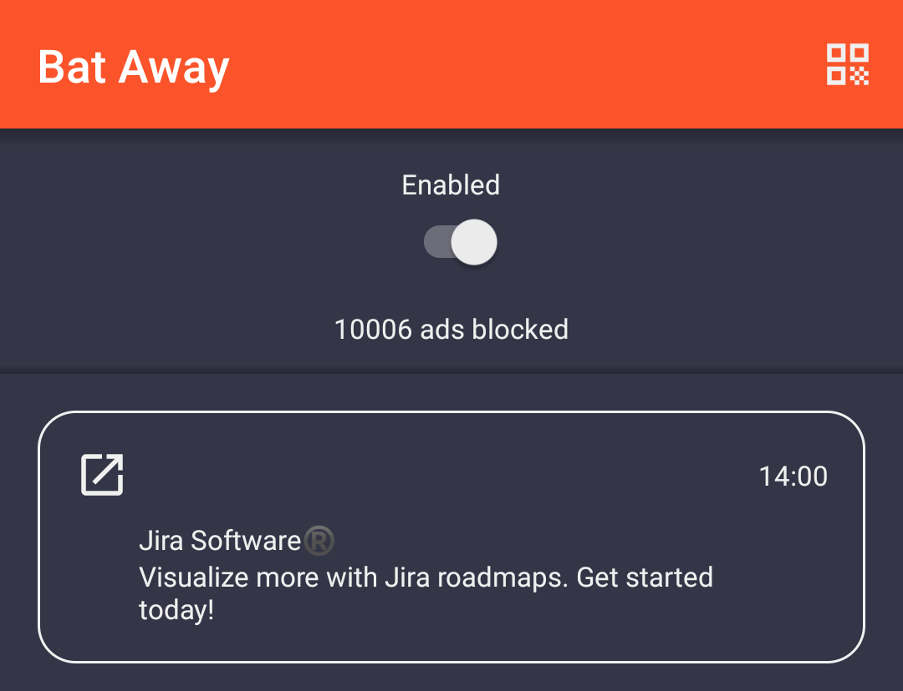

Bat Away 
=====================

Automatically dismiss Brave ad notifications on Android

Get Bat Away on [Google Play](https://play.google.com/store/apps/details?id=com.nightlynexus.bataway) or [download the apk](https://github.com/NightlyNexus/BatAway/releases)

1. Enable five ad notifications per hour on the Brave Android app at `brave://rewards/ads`

2. Enable Bat Away

3. The ad notifications will automatically be dismissed. Easy BAT

 

License
--------

    Copyright 2021 Eric Cochran

    Licensed under the Apache License, Version 2.0 (the "License");
    you may not use this file except in compliance with the License.
    You may obtain a copy of the License at

       http://www.apache.org/licenses/LICENSE-2.0

    Unless required by applicable law or agreed to in writing, software
    distributed under the License is distributed on an "AS IS" BASIS,
    WITHOUT WARRANTIES OR CONDITIONS OF ANY KIND, either express or implied.
    See the License for the specific language governing permissions and
    limitations under the License.
